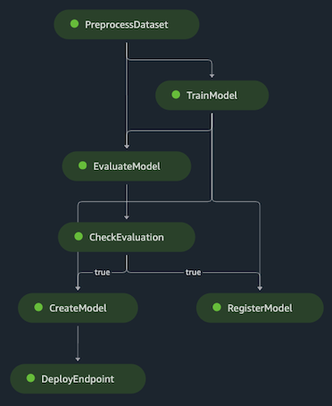
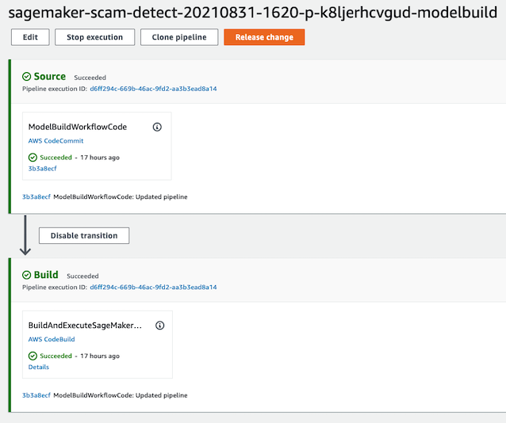

## Setting-up the MLOps workflow with Amazon SageMaker Projects & Pipelines

A typical ML project following the MLOps best-practices would involve the following steps:
1. Data-scientists experimenting in the sandbox via notebooks and IDE, e.g. with Amazon SageMaker Studio
2. Data-scientists sharing the ML artifacts (scripts, algos, etc.) with the Data-engineers for building the training pipelines, e.g. with Amazon SageMaker Pipelines
3. Data-engineers wrapping the pipeline into a project for connecting it with the CI/CD tools, e.g. with Amazon SageMaker Projects connected with AWS CodePipeline or Jenkins + AWS CodeCommit or GitHub

In this section of the repo you can:
- Explore how to set-up a training pipeline with Amazon SageMaker Pipelines (step 2 above), including the deployment of a testing endpoint, by following the notebook: [pipeline.ipynb](./pipeline.ipynb).

- Explore how to set-up the MLOps project with Amazon SageMaker Projects & AWS CodePipeline (step 3 above), for maintaining code/source control, by:
  - Following the instructions in the documentation for [Amazon SageMaker MLOps Project Walkthrough](https://docs.aws.amazon.com/sagemaker/latest/dg/sagemaker-projects-walkthrough.html). Choose the template: **"MLOps template for model Building and Training"**
  - In the **"Make a Change in the Code"** step, copy/replace the files included in this repo folder (pipeline.py, preprocess.py, evaluate.py, lambda_deploy.py, and codebuild-buildspec.yml) and commit your changes.

